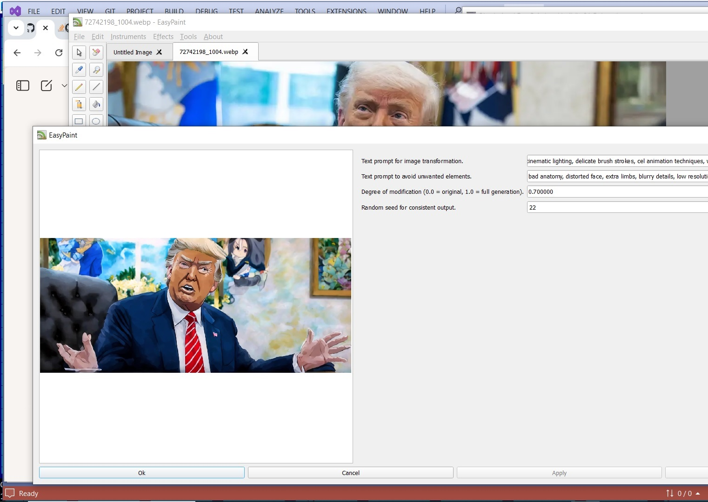
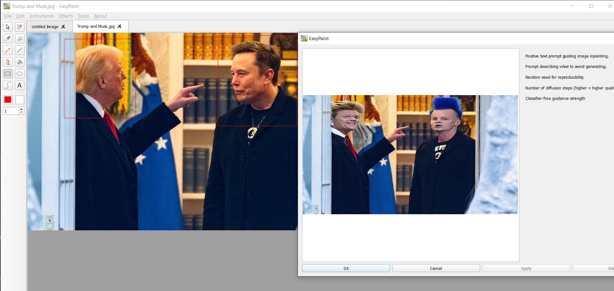

luster-ko
=========

luster-ko is a simple graphics editing program.

Installing
----------

Install luster-ko using the commands, if you use CMake:

    cd ./luster-ko
    cmake -DCMAKE_INSTALL_PREFIX=/usr
    make
    make install

License
-------

luster-ko is distributed under the [MIT license](http://www.opensource.org/licenses/MIT).

Python scripting
----------------

Users can write Python functions that are automatically exposed in the app’s menus once loaded.

## Getting Started
### 1. Install / Build

Windows: Unzip the prebuilt package.

Linux/macOS: Build the application from source.

### 2. Python Setup

Ensure the corresponding version of Python is installed.

(Optional but recommended) Create a virtual environment for dependencies:

    python -m venv venv
    source venv/bin/activate   # Linux/macOS
    venv\Scripts\activate      # Windows

### 3. Install Dependencies

Use the provided requirements.txt to install extra libraries (e.g., Hugging Face, OpenCV):

    pip install torch==2.7.0+cu126 torchvision==0.22.0 torchaudio==2.7.0 --index-url https://download.pytorch.org/whl/cu126
    pip install -r requirements.txt

### 4. Writing Scripts

Place your Python scripts in the designated directory.

Functions without a leading underscore (e.g., def my_tool():) will be exposed in the application’s menus when the script loads successfully.

Scripts can leverage all installed Python libraries.

- ✅ Cross-platform (Windows, Linux, macOS)
- ✅ Extensible via Python
- ✅ Supports external libs (Hugging Face, OpenCV, etc.)

# Python Scripting and Markup Mode

## Overview

Luster-ko provides a Python scripting subsystem that allows users to extend the application with custom image-processing functions.

Python functions are:

1. Loaded dynamically from script files.
2. Inspected automatically.
3. Exposed as menu actions.
4. Executed asynchronously.
5. Connected to the editor's image and markup layers.

The system supports two operating modes:

* **Image-only mode**
* **Image + Markup mode**

Markup mode allows Python scripts to receive and process a user-created mask/selection layer in addition to the main image.

---

# Architecture

```text
Python Script
      │
      ▼
 ScriptModel
      │
      ▼
 FunctionInfo
      │
      ▼
 ScriptEffect
      │
      ▼
 ImageArea
 ├─ Image
 └─ Markup
```

The central classes are:

| Class                  | Responsibility                                       |
| ---------------------- | ---------------------------------------------------- |
| `ScriptModel`          | Python interpreter management and function execution |
| `FunctionInfo`         | Metadata extracted from Python functions             |
| `ScriptEffect`         | Connects menu actions with Python execution          |
| `ScriptEffectSettings` | Generates parameter UI automatically                 |
| `ImageArea`            | Holds image and markup layers                        |

---

# Python Function Discovery

When a script is loaded, `ScriptModel`:

1. Starts an embedded Python interpreter (`pybind11`).
2. Executes the script.
3. Inspects all public functions.
4. Extracts signatures, annotations, defaults, and docstrings.
5. Builds a list of `FunctionInfo` objects.

Only public functions are exposed.

Example:

```python
def blur_image(
    image: numpy.ndarray,
    radius: float = 5.0
):
    ...
```

becomes a menu item automatically.

---

# Function Classification

The scripting system determines function behavior entirely from parameter types.

## Image Processing Function

```python
def blur_image(
    image: numpy.ndarray,
    radius: float = 5.0
):
    ...
```

Detected as:

```cpp
parameters[0].annotation == "<class 'numpy.ndarray'>"
```

Result:

* Receives current image
* Appears under image effects
* Operates on existing content

---

## Image Creation Function

```python
def generate_mandelbrot(
    width: int,
    height: int
):
    ...
```

Detected as:

```cpp
parameters.empty() ||
parameters[0].annotation != "<class 'numpy.ndarray'>"
```

via:

```cpp
bool isCreatingFunction() const
{
    return parameters.empty()
        || parameters[0].annotation != "<class 'numpy.ndarray'>";
}
```

Result:

* Creates a new image
* Does not require an existing image
* Opens result in a new tab

---

# Markup Mode

## What Is Markup?

Markup is a separate grayscale layer associated with an image.

Users can draw on this layer using markup tools.

Typical uses:

* Selection masks
* Inpainting masks
* Protected regions
* Processing constraints
* Region-of-interest editing

Conceptually:

```text
ImageArea
├── RGB Image
└── Grayscale Markup
```

---

# Detecting Markup Support

Markup support is determined automatically from the function signature.

Implementation:

```cpp
bool usesMarkup() const
{
    return parameters.size() > 1 &&
           parameters[1].annotation ==
           "<class 'numpy.ndarray'>";
}
```

A function uses markup when:

* Parameter #1 is the image
* Parameter #2 is another NumPy array

Example:

```python
def inpaint(
    image: numpy.ndarray,
    markup: numpy.ndarray
):
    ...
```

The second image parameter is interpreted as the markup layer.

---

# How Image and Markup Are Passed

When an effect executes:

```cpp
QVariantList args;

args << image;

if (mFunctionInfo.usesMarkup())
    args << markup;
```

Therefore:

## Image-only Function

```python
def blur_image(image):
    ...
```

receives:

```python
image
```

---

## Markup-Aware Function

```python
def inpaint(image, markup):
    ...
```

receives:

```python
image
markup
```

The markup is supplied automatically.

No manual retrieval is necessary.

---

# Data Conversion

The bridge converts Qt images to NumPy arrays.

## Qt → Python

```text
QImage
    ↓
numpy.ndarray
```

Supported formats:

* RGB images
* Grayscale images
* Float images

The Python side always sees NumPy arrays.

Example:

```python
def process(image):
    print(image.shape)
```

---

## Python → Qt

Returned NumPy arrays are converted back to:

```text
numpy.ndarray
      ↓
QImage
```

and inserted into the editor.

---

# Returning Results

A Python function returns a NumPy array.

Example:

```python
def invert(image):
    return 255 - image
```

The returned array becomes the new image.

---

# Returning Markup

The application determines destination by image format.

When a grayscale image is returned:

```cpp
if (img.format() == QImage::Format_Grayscale8)
    imageArea->setMarkup(img);
else
    imageArea->setImage(img);
```

Therefore a script can generate:

* a new image
* a new markup layer

depending on the returned data.

---

# Automatic Parameter UI

Function parameters automatically generate controls.

Example:

```python
def blur_image(
    image,
    radius: float = 5.0,
    iterations: int = 3,
    enabled: bool = True
):
    ...
```

Produces:

| Python Type | UI Control       |
| ----------- | ---------------- |
| `int`       | Spin box         |
| `float`     | Numeric text box |
| `double`    | Numeric text box |
| `bool`      | Check box        |
| `str`       | Text box         |
| `tuple`     | Text box         |
| `complex`   | Complex editor   |

No UI code is required.

---

# Docstring Integration

Docstrings are parsed automatically.

Example:

```python
def blur_image(
    image,
    radius: float = 5.0
):
    """
    Blur image.

    Args:
        radius (float):
            Blur radius.
    """
```

The parser extracts:

* Function description
* Parameter descriptions
* Parameter types

These values populate the UI and tooltips.

---

# Asynchronous Execution

Scripts execute in a worker thread.

```cpp
QtConcurrent::run(...)
```

Execution flow:

```text
User Action
     │
     ▼
Worker Thread
     │
     ▼
Python Function
     │
     ▼
Result Image
```

During execution:

* Main window is disabled
* Spinner overlay is shown
* UI remains responsive

---

# Progress Images

The Python runtime exposes:

```python
_send_image(...)
```

A script can send intermediate images:

```python
_send_image(preview)
```

This enables:

* Live previews
* Progress visualization
* Iterative algorithms

---

# Cancellation Support

Python receives:

```python
_check_interrupt()
```

Example:

```python
for i in range(10000):

    if _check_interrupt():
        break

    ...
```

This allows long-running scripts to stop safely.

---

# Python Console Output

`stdout` and `stderr` are redirected to the application.

Example:

```python
print("Loading model...")
```

appears inside the built-in Python console.

Supported output:

* `print()`
* Exceptions
* Warnings
* tqdm progress bars

---

# Typical Markup Workflow

## User Side

1. Enable **Markup Mode**
2. Draw mask
3. Run Python effect

---

## Script Side

```python
def inpaint(
    image,
    markup
):
    result = model.inpaint(
        image,
        mask=markup
    )

    return result
```

---

# Typical Processing Pipeline

```text
User draws markup
        │
        ▼
ImageArea
 ├─ Image
 └─ Markup
        │
        ▼
ScriptEffect
        │
        ▼
ScriptModel
        │
        ▼
Python Function
        │
        ▼
NumPy Result
        │
        ▼
QImage
        │
        ▼
Editor Update
```

---

# Summary

The scripting system is built around automatic discovery of Python functions and automatic conversion between Qt images and NumPy arrays.

Key features include:

* Dynamic Python function discovery
* Embedded Python interpreter
* Automatic parameter UI generation
* NumPy image exchange
* Asynchronous execution
* Console output redirection
* Progress image support
* Cancellation support
* Optional markup-mask processing

Markup mode integrates seamlessly with scripting: if a Python function declares a second `numpy.ndarray` parameter, the editor automatically passes the current markup layer, enabling mask-aware image processing, inpainting, selection-based effects, and region-specific operations.

## Python Scripts Overview

These Python scripts extend the paint application with **image generation, transformation, and enhancement features**.  
See scripts folder for examples.

---

### `depth2img.py`
This script focuses on **depth-guided image transformation**. It transforms images using depth maps to maintain scene geometry.

- **Functions**
  - `generate_depth_image` — Transforms an image based on depth information, preserving scene structure.

---

### `img2img.py`
This script supports **image-to-image translation**, transforming an existing picture while keeping its overall structure.

- **Functions**
  - `generate_img2img` — Produces a modified version of an input image while maintaining its overall structure.

**Key Technical Differences**
=============================

1\. **Model architecture**
--------------------------

### img2img.py

Uses **SD 1.5 img2img**, which:

*   Adds noise according to strength
    
*   Re-generates the image guided by the prompt➡️ **No understanding of scene depth**.➡️ Geometry/sizes may drift or distort.
    

### depth2img.py

Uses **SD2 depth-guided diffusion**, where the model gets:

*   The RGB image
    
*   A predicted **depth map**
    
*   The prompt
    

➡️ Much stronger preservation of layout and shapes➡️ Camera angle, perspective, object proportions remain stable

2\. **Capabilities**
--------------------

### **img2img — what it’s good at**

✔ Style transfer

✔ Recoloring, mood changes

✔ Artistic transformations

✔ Turning sketches into paintings

✔ Significant prompt-driven changes (faces, objects, lighting)

✖ Geometry preservation is weak

✖ Objects may shift or deform

✖ Hard for realism with strict constraints

### **depth2img — what it's good at**

✔ Structure-preserving realism

✔ Maintaining perspective, edges, contours

✔ Photo → enhanced photo

✔ Background replacement with stable foreground

✔ Consistent character/object shape

✔ Keeping hands, body positions, architecture stable

✖ Less flexible for wild artistic transformations

✖ More literal to original image

3\. **Quality / Visual Differences**
------------------------------------

### img2img output tends to:

*   Drift away from the original image at higher strengths
    
*   Change shapes, edges, even composition
    
*   Be more creative (good or bad)
    

### depth2img output tends to:

*   Stay loyal to the original layout
    
*   Preserve contours, buildings, bodies
    
*   Produce realism with stable object boundaries
    
*   Allow big _semantic_ changes while preserving geometry
    

4\. **Strength parameter differences**
--------------------------------------

### In img2img:

strength = how much noise is added

*   0.1 → slight stylization
    
*   0.5 → strong change
    
*   0.9 → almost full re-generation
    

### In depth2img:

Depth condition provides stability even with high strength

*   0.1 → mild color/stylistic tweaks
    
*   0.5 → significant transformation but geometry kept
    
*   0.9 → still retains shapes better than img2img
    

5\. **Underlying Model Versions**
---------------------------------

### img2img.py → **Stable Diffusion 1.5**

*   Better for stylization
    
*   Less realistic
    
*   More artifacts
    
*   Weaker at human anatomy
    

### depth2img.py → **Stable Diffusion 2.0–depth**

*   Better depth understanding
    
*   Realistic rendering
    
*   Much more stable human shapes
    
*   Preserves backgrounds and structure
    

🧠 **Summary: When to choose which?**
=====================================

### Use **img2img.py** if:

*   You want creative variation
    
*   You want to heavily stylize or reimagine
    
*   You want surreal / artistic transformations
    
*   You don't need strict preservation of shapes
    

### Use **depth2img.py** if:

*   You want to keep the geometry
    
*   You want realistic or photographic edits
    
*   You want to keep perspective and composition stable
    
*   You want to change style but preserve structure
    
*   You are editing photos or production artwork
    

🚀 **Practical example**
========================

Input: photo of a building

**img2img** → might reshape windows, add floors, distort lines

**depth2img** → keeps building straight, only changes textures/colors
Input: portrait

**img2img** → risks face changes

**depth2img** → keeps same face geometry, pose, lighting

---

### `generate.py`
This script provides a **basic image generation entry point** for creating images from scratch.

- **Functions**
  - `generate_image` — Creates an image from scratch, typically using a generative model (e.g., diffusion).

---

### `inpaint.py`
This script specializes in **inpainting**, i.e., filling in missing or masked areas with contextually appropriate content.

- **Functions**
  - `predict` — Performs inpainting by filling missing or masked image areas with context-aware content.

---

### `script.py`
This script provides **general-purpose image processing and procedural generation tools**.  
It includes filtering, corrections, resizing, and fractal/texture generators.

- **Functions**
  - `denoise_image` — Reduces unwanted noise or grain in an image.  
  - `blur_image` — Applies a blur filter.  
  - `deblur_image` — Restores sharpness to a blurred image.  
  - `gamma_correct` — Adjusts brightness and contrast through gamma correction.  
  - `enhance_contrast` — Improves visibility of details by adjusting contrast.  
  - `resize_image` — Rescales an image to new dimensions.  
  - `generate_mandelbrot` — Produces a Mandelbrot fractal image.  
  - `generate_julia` — Produces a Julia set fractal image.  
  - `generate_plasma` — Creates a plasma-like procedural texture.

---

### `style_transfer.py`
This script implements **style transfer**, allowing users to apply the artistic style of one image to another.

- **Functions**
  - `set_as_style` — Selects an image as a reference style.  
  - `transfer_style` — Transfers the reference style onto another image.

Enable Instruments -> Markup mode to use markup:





